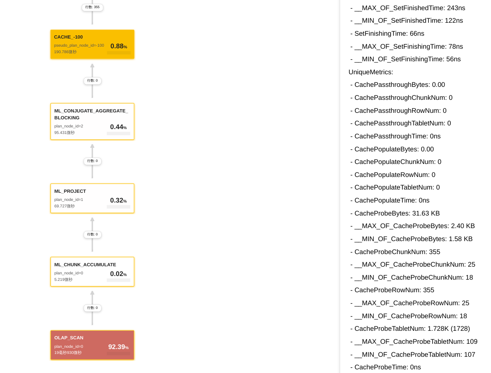
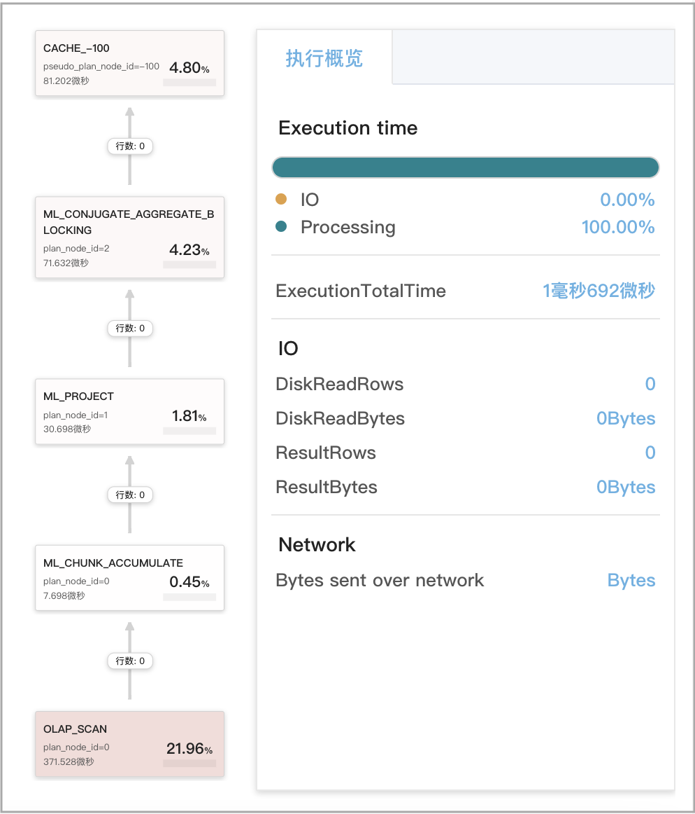
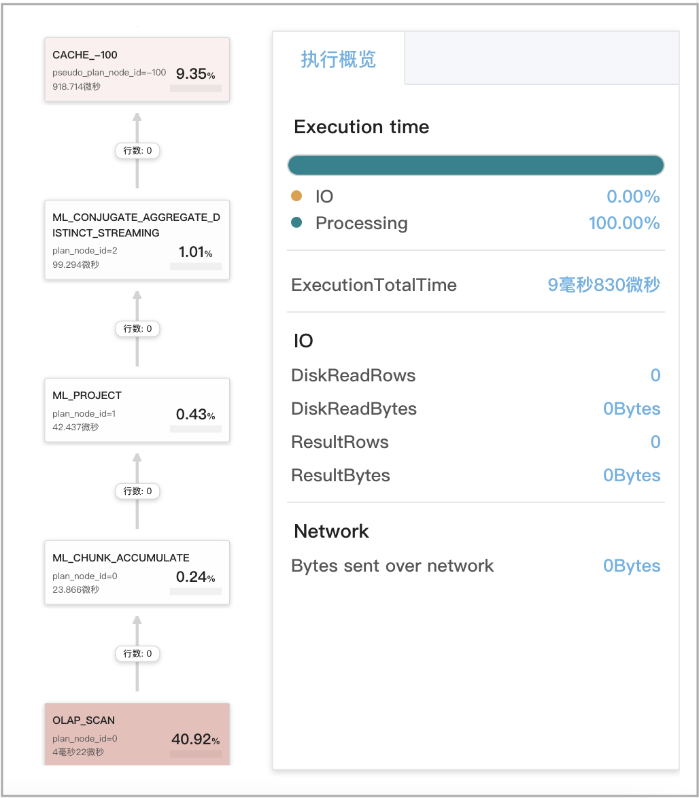
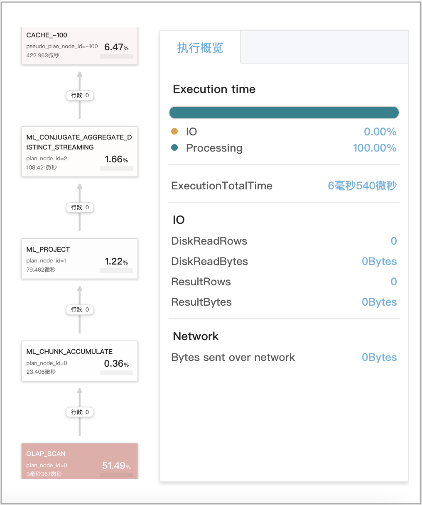
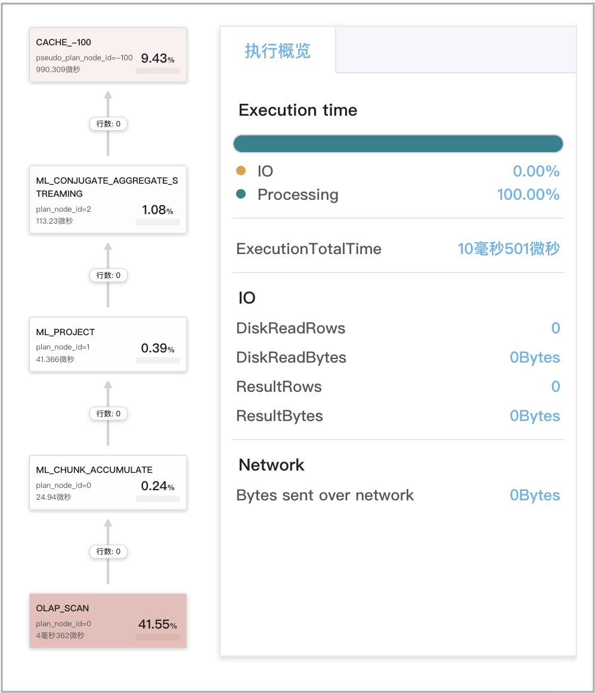
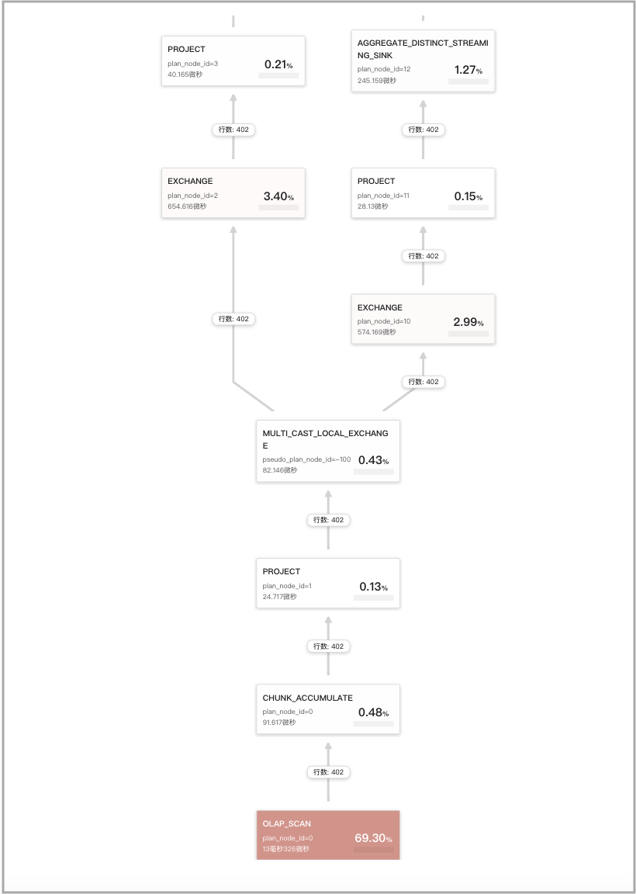
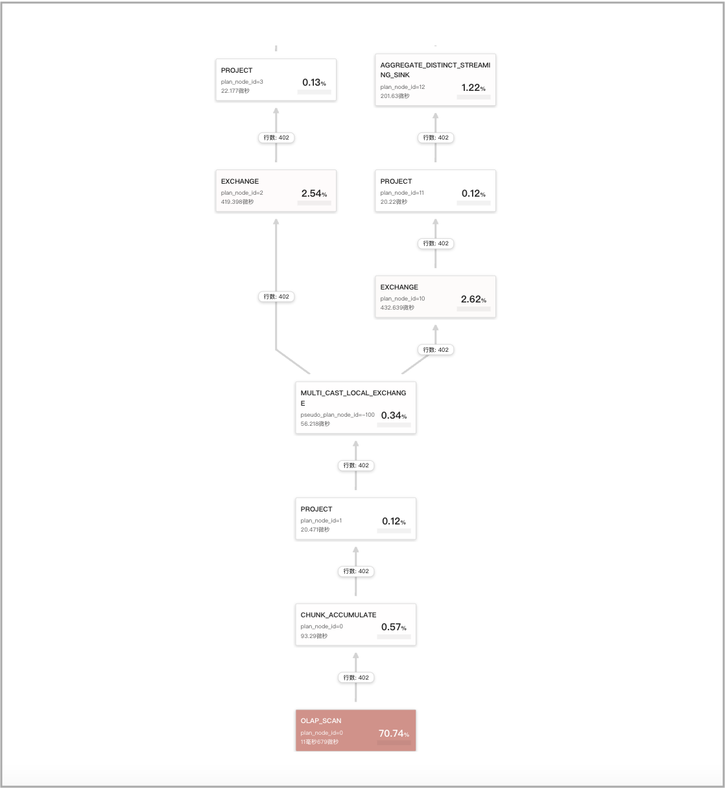
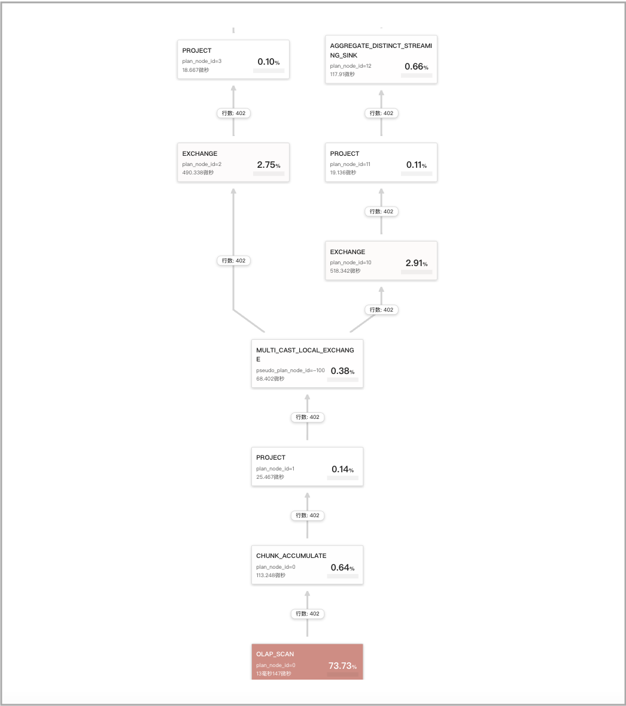

# Query Cache

Query Cache 可以保存查询的中间计算结果。后续发起的语义等价的查询，能够复用先前缓存的结果，加速计算，从而提升高并发场景下简单聚合查询的 QPS 并降低平均时延。

您可以通过 FE 会话变量 `enable_query_cache` 开启 Query Cache。参见本文“[FE 会话变量](../using_starrocks/query_cache.md#fe-会话变量)”小节。

## 应用场景

Query Cache 可以生效的典型应用场景有如下特点：

- 查询多为宽表模型下的单表聚合查询、或星型模型下简单多表 JOIN 的聚合查询。
- 聚合查询以非 GROUP BY 聚合和低基数 GROUP BY 聚合为主。
- 查询的数据以按时间分区追加的形式导入，并且在不同时间分区上的访问表现出冷热性。

目前 Query Cache 支持的查询需要满足下面条件：

- 查询的执行引擎为 Pipeline。

  > **说明**
  >
  > 除 Pipeline 以外的其他执行引擎不支持 Query Cache。

- 查询的表为原生 OLAP 表。不支持外表上的查询。查询计划中，实际访问的是单表物化视图时，Query Cache 也可以生效。多表物化视图暂不支持。

- 查询为单表聚合查询。

  > **说明**
  >
  > 后续会支持多表做 Colocate Join、Broadcast Join、Bucket Shuffle Join 之后再聚合的查询。

- 查询不包含 `rand`、`random`、`uuid` 和 `sleep` 等不确定性 (Nondeterminstic) 函数。

Query Cache 支持全部数据分区策略，包括 Unpartitioned、Multi-Column Partitioned 和 Single-Column Partitioned。

## 产品边界

- Query Cache 依赖于 Pipeline 执行引擎的 Per-Tablet 计算。Per-Tablet 计算是指一个 Pipeline Driver 能够以表为单位对整表进行处理，而不是每次只处理一个 Tablet 的一部分、或者通过交叉并发的方式同时处理多个 Tablet。如果所访问的 Tablet 的数量大于等于实际调用的 Pipeline Driver 的数量（即，实际并发度）时，则启用 Query Cache。如果所访问的 Tablet 的数量小于 Pipeline Driver 的数量，则每个 Pipeline Driver 只会处理某个 Tablet 的一部分数据，无法形成 Per-Tablet 的计算结果，这种情况下不启用 Query Cache。
- 在 StarRocks 中，一个聚合查询至少包含四个阶段的聚合。在一阶段聚合中，只有当 OlapScanNode 和 AggregateNode 位于同一个 Fragment 时，AggregateNode 产生的 Per-Tablet 计算结果才会缓存。在其他阶段聚合中，AggregateNode 产生的Per-Tablet 计算结果不会缓存。部分 DISTINCT 聚合查询，受会话变量 `cbo_cte_reuse` 为 `true` 影响，当执行计划中生产数据的 OlapScanNode 和消费数据的一阶段 AggregateNode 位于不同的 Fragment、并且中间通过 ExchangeNode 传输数据时，也不启用 Query Cache。比如如下两个场景里，采用 CTE 优化，不启用 Query Cache：
  - 查询的输出列包含聚合函数 `avg(distinct)`。
  - 查询的输出列含多个 DISTINCT 聚合函数。

## 参数配置

本小节介绍用于开启和配置 Query Cache 的参数和会话变量。

### FE 会话变量

| **变量**                    | **默认值** | **是否支持动态修改** | **说明**                                                     |
| --------------------------- | ---------- | -------------------- | ------------------------------------------------------------ |
| enable_query_cache          | false      | 是                   | 指定是否开启 Query Cache。取值范围：`true` 和 `false`。`true` 表示开启，`false` 表示关闭。开启该功能后，只有当查询满足本文“[应用场景](../using_starrocks/query_cache.md#应用场景)”小节所述之条件时，才会启用 Query Cache。 |
| query_cache_force_populate  | false      | 是                   | 指定是否忽略 Query Cache 中已有的计算结果。取值范围：`true` 和 `false`。`true` 表示开启，`false` 表示关闭。开启该功能后，StarRocks 在执行查询计算时，会忽略 Query Cache 中已有的计算结果，重新回源读取、计算数据并更新 Query Cache。<br>因此，`query_cache_force_populate=true` 等效于缓存不命中 (Cache Miss)。 |
| query_cache_entry_max_bytes | 4194304    | 是                   | 指定触发 Passthrough 模式的阈值。取值范围：`0` ~ `9223372036854775807`。当一个 Tablet 上产生的计算结果的字节数或者行数超过 `query_cache_entry_max_bytes` 或 `query_cache_entry_max_rows` 指定的阈值时，则查询采用 Passthrough 模式执行。<br>当 `query_cache_entry_max_bytes` 或 `query_cache_entry_max_rows` 取值为 `0` 时, 即便 Tablet 产生结果为空，也采用 Passthrough 模式。 |
| query_cache_entry_max_rows  | 409600     | 是                   | 同上。                                                           |

### BE 配置项

您需要在 BE 配置文件 **be.conf** 里设置下面参数。更改下面参数的设置以后，需要重启 BE 才能使参数设置生效。

| **参数**             | **必填** | **描述**                                                     |
| -------------------- | -------- | ------------------------------------------------------------ |
| query_cache_capacity | 否       | 指定 Query Cache 的大小。单位：字节。默认为 512 MB。最小不低于 4 MB。如果当前的 BE 内存容量无法满足您期望的 Query Cache 大小，可以增加 BE 的内存容量，然后再设置合理的 Query Cache 大小。<br>每个 BE 都有自己私有的 Query Cache 存储空间，BE 只 Populate 或 Probe 自己本地的 Query Cache 存储空间。 |

## 原理解释

### 语义等价

如果两个查询相似（这两个查询不一定字面上完全一致、但是其执行计划在语义上是相等的），则这两个查询可以复用彼此先前计算的结果。通俗地说，语义等价是指两个查询计算的数据来源相同、计算方式相同、并且具有相似的执行计划。严格地说，判定两个查询是否语义等价的规则如下：

- 两个查询如果包含多次聚合，只要这两个查询中的第一次聚合是语义等价的，则判定为语义等价。例如下面两个查询，Q1 和 Q2。Q1 的第一次聚合和 Q2 的第一次聚合是等价的，因此这两个查询的计算结果可以彼此复用。

  - Q1

    ```SQL
    SELECT
        (
            ifnull(sum(murmur_hash3_32(hour)), 0) + ifnull(sum(murmur_hash3_32(k0)), 0) + ifnull(sum(murmur_hash3_32(__c_0)), 0)
        ) AS fingerprint
    FROM
        (
            SELECT
                date_trunc('hour', ts) AS hour,
                k0,
                sum(v1) AS __c_0
            FROM
                  t0
            WHERE
                ts BETWEEN '2022-01-03 00:00:00'
                AND '2022-01-03 23:59:59'
            GROUP BY
                date_trunc('hour', ts),
                k0
        ) AS t;
    ```

  - Q2

    ```SQL
    SELECT
        date_trunc('hour', ts) AS hour,
        k0,
        sum(v1) AS __c_0
    FROM
        t0
    WHERE
        ts BETWEEN '2022-01-03 00:00:00'
        AND '2022-01-03 23:59:59'
    GROUP BY
        date_trunc('hour', ts),
        k0
    ```

- 两个查询都符合下面四类查询中的同一类型，则可判定为语义等价。两个查询中，有 HAVING 子句的查询和无 HAVING 子句的查询不等价。同一类型的查询中，是否含有 ORDER BY 子句和 LIMIT 子句，不影响两个查询的语义等价。

  - GROUP BY 聚合

    ```SQL
    SELECT <GroupByItems>, <AggFunctionItems> 
    FROM <Table> 
    WHERE <Predicates> [and <PartitionColumnRangePredicate>]
    GROUP BY <GroupByItems>
    [HAVING <HavingPredicate>] 
    ```

    > **说明**
    >
    > HAVING 子句为可选。

  - GROUP BY DISTINCT 聚合

    ```SQL
    SELECT DISTINCT <GroupByItems>, <Items> 
    FROM <Table> 
    WHERE <Predicates> [and <PartitionColumnRangePredicate>]
    GROUP BY <GroupByItems>
    HAVING <HavingPredicate>
    ```

    > **说明**
    >
    > HAVING 子句为可选。

  - 非 GROUP BY 聚合

    ```SQL
    SELECT <AggFunctionItems> FROM <Table> 
    WHERE <Predicates> [and <PartitionColumnRangePredicate>]
    ```

  - 非 GROUP BY DISTINCT 聚合

    ```SQL
    SELECT DISTINCT <Items> FROM <Table> 
    WHERE <Predicates> [and <PartitionColumnRangePredicate>]
    ```

- 如果两个查询中任意一个查询包含 `PartitionColumnRangePredicate`，则删除 `PartitionColumnRangePredicate` 后再判断是否语义等价。`PartitionColumnRangePredicate` 是指谓词引用的列为分区列、并且谓词为以下五种类型的谓词之一：

  - `col between v1 and v2`：分区列的取值属于区间 [v1, v2]，其中 `v1`、`v2` 为常量表达式。
  - `v1 < col and col < v2`：分区列的取值属于区间 (v1, v2)，其中 `v1`、`v2` 为常量表达式。
  - `v1 < col and col <= v2`：分区列的取值属于区间 (v1, v2]，其中 `v1`、`v2` 为常量表达式。
  - `v1 <= col and col < v2`：分区列的取值属于区间 [v1, v2)，其中 `v1`、`v2` 为常量表达式。
  - `v1 <= col and col <= v2`：分区列的取值属于区间 [v1, v2]，其中`v1`、`v2` 为常量表达式。

- 如果两个查询的 SELECT 输出列经过重排后相同，则判定为语义等价。

- 如果两个查询都包含 GROUP BY 子句、并且它们的 GROUP BY 输出列经过重排后相同，则判定为语义等价。

- 如果两个查询都包含 WHERE 子句、并且它们的 WHERE 子句中移除 `PartitionColumnRangePredicate` 后剩下的谓词完全等价，则判定为语义等价。

- 如果两个查询都包含 HAVING 子句、并且它们的 HAVING 子句中的谓词完全等价，则判定为语义等价。

比如，我们以如下一张标准表 `lineorder_flat` 为例：

```SQL
CREATE TABLE `lineorder_flat`
(
    `lo_orderdate` date NOT NULL COMMENT "",
    `lo_orderkey` int(11) NOT NULL COMMENT "",
    `lo_linenumber` tinyint(4) NOT NULL COMMENT "",
    `lo_custkey` int(11) NOT NULL COMMENT "",
    `lo_partkey` int(11) NOT NULL COMMENT "",
    `lo_suppkey` int(11) NOT NULL COMMENT "",
    `lo_orderpriority` varchar(100) NOT NULL COMMENT "",
    `lo_shippriority` tinyint(4) NOT NULL COMMENT "",
    `lo_quantity` tinyint(4) NOT NULL COMMENT "",
    `lo_extendedprice` int(11) NOT NULL COMMENT "",
    `lo_ordtotalprice` int(11) NOT NULL COMMENT "",
    `lo_discount` tinyint(4) NOT NULL COMMENT "",
    `lo_revenue` int(11) NOT NULL COMMENT "",
    `lo_supplycost` int(11) NOT NULL COMMENT "",
    `lo_tax` tinyint(4) NOT NULL COMMENT "",
    `lo_commitdate` date NOT NULL COMMENT "",
    `lo_shipmode` varchar(100) NOT NULL COMMENT "",
    `c_name` varchar(100) NOT NULL COMMENT "",
    `c_address` varchar(100) NOT NULL COMMENT "",
    `c_city` varchar(100) NOT NULL COMMENT "",
    `c_nation` varchar(100) NOT NULL COMMENT "",
    `c_region` varchar(100) NOT NULL COMMENT "",
    `c_phone` varchar(100) NOT NULL COMMENT "",
    `c_mktsegment` varchar(100) NOT NULL COMMENT "",
    `s_name` varchar(100) NOT NULL COMMENT "",
    `s_address` varchar(100) NOT NULL COMMENT "",
    `s_city` varchar(100) NOT NULL COMMENT "",
    `s_nation` varchar(100) NOT NULL COMMENT "",
    `s_region` varchar(100) NOT NULL COMMENT "",
    `s_phone` varchar(100) NOT NULL COMMENT "",
    `p_name` varchar(100) NOT NULL COMMENT "",
    `p_mfgr` varchar(100) NOT NULL COMMENT "",
    `p_category` varchar(100) NOT NULL COMMENT "",
    `p_brand` varchar(100) NOT NULL COMMENT "",
    `p_color` varchar(100) NOT NULL COMMENT "",
    `p_type` varchar(100) NOT NULL COMMENT "",
    `p_size` tinyint(4) NOT NULL COMMENT "",
    `p_container` varchar(100) NOT NULL COMMENT ""
)
ENGINE=OLAP 
DUPLICATE KEY(`lo_orderdate`, `lo_orderkey`)
COMMENT "olap"
PARTITION BY RANGE(`lo_orderdate`)
(PARTITION p1 VALUES [('0000-01-01'), ('1993-01-01')),
PARTITION p2 VALUES [('1993-01-01'), ('1994-01-01')),
PARTITION p3 VALUES [('1994-01-01'), ('1995-01-01')),
PARTITION p4 VALUES [('1995-01-01'), ('1996-01-01')),
PARTITION p5 VALUES [('1996-01-01'), ('1997-01-01')),
PARTITION p6 VALUES [('1997-01-01'), ('1998-01-01')),
PARTITION p7 VALUES [('1998-01-01'), ('1999-01-01')))
DISTRIBUTED BY HASH(`lo_orderkey`) BUCKETS 48 
PROPERTIES
(
    "replication_num" = "1",
    "colocate_with" = "groupxx1",
    "in_memory" = "false",
    "storage_format" = "DEFAULT",
    "enable_persistent_index" = "false",
    "compression" = "LZ4"
);
```

下面两个查询 Q1 和 Q2 在经过如下处理之后，可以判定为语义等价：

1. 重排 SELECT 输出列。
2. 重排 GROUP BY 输出列。
3. 删除 ORDER BY 输出列。
4. 重排 WHERE 中的谓词。
5. 添加 `PartitionColumnRangePredicate`。

- Q1

  ```SQL
  SELECT sum(lo_revenue)), year(lo_orderdate) AS year,p_brand
  FROM lineorder_flat
  WHERE p_category = 'MFGR#12' AND s_region = 'AMERICA'
  GROUP BY year,p_brand
  ORDER BY year,p_brand;
  ```

- Q2

  ```SQL
  SELECT year(lo_orderdate) AS year, p_brand, sum(lo_revenue))
  FROM lineorder_flat
  WHERE s_region = 'AMERICA' AND p_category = 'MFGR#12' AND 
     lo_orderdate >= '1993-01-01' AND lo_orderdate <= '1993-12-31'
  GROUP BY p_brand, year(lo_orderdate)
  ```

判定两个查询是否等价，是基于查询的物理计划，因此两个查询的字面上差异，不影响语义等价的判定。其次，查询中可以消除常量表达式计算，`cast` 表达式在查询的规划阶段已经消除，因此这些表达式不影响语义等价的判定。再次，Column 和 Relation 的别名同样也不影响等价判定。

### 谓词分解

通过谓词分解，可以实现部分结算结果的复用。当查询中含有分区谓词（即，含有分区列的谓词）并且分区谓词表示范围时，可以将范围按照数据表的分区分解成小的区间。各区间内的计算结果，可以分别复用于其他查询。

以如下一张数据表 `t0` 为例：

```SQL
CREATE TABLE if not exists t0
(
    ts DATETIME NOT NULL,
    k0 VARCHAR(10) NOT NULL,
    k1 BIGINT NOT NULL,
    v1 DECIMAL64(7, 2) NOT NULL 
)
ENGINE=OLAP
DUPLICATE KEY(`ts`, `k0`, `k1`)
COMMENT "OLAP"
PARTITION BY RANGE(ts)
(
  START ("2022-01-01 00:00:00") END ("2022-02-01 00:00:00") EVERY (INTERVAL 1 day) 
)
DISTRIBUTED BY HASH(`ts`, `k0`, `k1`) BUCKETS 1
PROPERTIES
(
    "replication_num" = "1", 
    "in_memory" = "false",
    "storage_format" = "default"
);
```

表 `t0` 按天分区，`ts` 为分区列。下面的四个查询中，Q2、Q3 和 Q4 可以复用 Q1 的部分计算结果：

- Q1

  ```SQL
  SELECT date_trunc('day', ts) as day, sum(v0)
  FROM t0
  WHERE ts BETWEEN '2022-01-02 12:30:00' AND '2022-01-14 23:59:59'
  GROUP BY day;
  ```

  Q1 的分区谓词 `ts between '2022-01-02 12:30:00' and '2022-01-14 23:59:59'` 可以分解为如下几个区间：

  ```SQL
  1. [2022-01-02 12:30:00, 2022-01-03 00:00:00),
  2. [2022-01-03 00:00:00, 2022-01-04 00:00:00),
  3. [2022-01-04 00:00:00, 2022-01-05 00:00:00),
  ...
  12. [2022-01-13 00:00:00, 2022-01-14 00:00:00),
  13. [2022-01-15 00:00:00, 2022-01-15 00:00:00),
  ```

- Q2

  ```SQL
  SELECT date_trunc('day', ts) as day, sum(v0)
  FROM t0
  WHERE ts >= '2022-01-02 12:30:00' AND  ts < '2022-01-05 00:00:00'
  GROUP BY day;
  ```

  Q2 可以复用 Q1 如下区间的计算结果：

  ```SQL
  1. [2022-01-02 12:30:00, 2022-01-03 00:00:00),
  2. [2022-01-03 00:00:00, 2022-01-04 00:00:00),
  3. [2022-01-04 00:00:00, 2022-01-05 00:00:00),
  ```

- Q3

  ```SQL
  SELECT date_trunc('day', ts) as day, sum(v0)
  FROM t0
  WHERE ts >= '2022-01-01 12:30:00' AND  ts <= '2022-01-10 12:00:00'
  GROUP BY day;
  ```

  Q3 可以复用 Q1 如下区间的计算结果：

  ```SQL
  2. [2022-01-03 00:00:00, 2022-01-04 00:00:00),
  3. [2022-01-04 00:00:00, 2022-01-05 00:00:00),
  ...
  9. [2022-01-09 00:00:00, 2022-01-10 00:00:00),
  ```

- Q4

  ```SQL
  SELECT date_trunc('day', ts) as day, sum(v0)
  FROM t0
  WHERE ts BETWEEN '2022-01-02 12:30:00' and '2022-01-02 23:59:59'
  GROUP BY day;
  ```

  Q4 可以复用 Q1 如下区间的计算结果：

  ```SQL
  1. [2022-01-02 12:30:00, 2022-01-03 00:00:00),
  ```

部分结果复用功能的支持情况与分区策略相关，如下表所述。

| **分区策略**              | **是否支持部分结果复用**        |
| ------------------------- | ------------------------------- |
| Unpartitioned             | 不支持                          |
| Multi-Column Partitioned  | 不支持<br>**说明**<br>未来可能会支持。 |
| Single-Column Partitioned | 支持                            |

### 多版本 Cache 机制

随着数据导入，Tablet 会产生新的版本，进而导致 Query Cache 中缓存结果的 Tablet 版本落后于实际的 Tablet 版本。这时候，多版本 Cache 机制会尝试把 Query Cache 中缓存的结果与磁盘上存储的增量数据合并，确保新查询能够获取到最新版本的 Tablet 数据。多版本 Cache 机制的运行受限于数据模型、查询类型、以及数据更新类型。

不同的数据模型和查询类型对多版本 Cache 机制的支持如下表所述。

| **数据模型** | **查询类型**               | **多版本 Cache 机制的支持**                                  |
| ------------ | -------------------------- | ------------------------------------------------------------ |
| 明细模型     | <ul><li>基表查询</li><li>单表物化视图查询</li></ul>   | <ul><li>基表查询：仅当增量版本含删除记录时不支持。其他情况下都支持。</li><li>单表物化视图查询：仅当查询的 GROUP BY、HAVING、或 WHERE 子句中引用聚合列时不支持。其他情况下都支持。</li></ul> |
| 聚合模型     | 基表查询或单表物化视图查询 | 仅在以下场景不支持：基表的 Schema 中含聚合函数 `replace`。查询的 GROUP BY、HAVING、或 WHERE 子句中引用聚合列。增量版本含删除记录。其他情况下都支持。 |
| 更新模型     | 不涉及                     | 支持 Query Cache，但不支持多版本 Cache 机制。                |
| 主键模型     | 不涉及                     | 支持 Query Cache，但不支持多版本 Cache 机制。                |

不同的数据更新类型对多版本 Cache 机制的影响如下所述：

- 数据删除

  删除 Tablet 增量数据会导致多版本 Cache 机制无效。

- 数据导入

  - 如果在 Tablet 上产生了空的新版本，则 Query Cache 中已有的数据仍然有效，查询时可以直接从 Query Cache 中获取数据。
  - 如果在 Tablet 上产生了非空的新版本，则虽然 Query Cache 中已有的数据仍然有效，但是已有数据的版本已经落后于最新的 Tablet 版本。此时需要从 Tablet 中读取从已有数据的版本到 Tablet 最新版本之间的增量数据，把已有数据和增量版本计算结果合并，然后把合并后的数据结果重新填充到 Query Cache。

- 表结构 (Schema) 变更与 Tablet 剪裁

  表结构变更与 Tablet 剪裁会产生全新的 Tablet，导致 Query Cache 中已有的数据失效。

### Passthrough 机制

Query Cache 的存储占用 BE 的少量内存，默认缓存大小为 512 MB，因此不宜缓存较大的数据项。此外，在启用 Query Cache 的情况下，如果缓存的命中率低，则会带来性能惩罚。因此，在查询的计算过程中，如果某一个 Tablet 上的计算结果大小超过了 `query_cache_entry_max_bytes` 或 `query_cache_entry_max_rows` 参数指定的阈值，则该查询接下来的计算不再开启 Query Cache，转而触发使用 Passthrough 机制来执行。

## 监控指标

在查询使用 Query Cache 时，Profile 中会出现 `CacheOperator` 的统计情况，如下图所示。



首先，源执行计划里，含 `OlapScanOperator` 的 Pipeline 中，从 `OlapScanOperator` 后继算子到聚合算子的算子名会添加前缀 `ML_`，表示当前的 Pipeline 引入了 `MultilaneOperator` 做 Per-Tablet 计算。`ML_CONJUGATE_AGGREGATE` 算子上方插入了 `CacheOperator`，该 `CacheOperator` 处理 Query Cache 在 Passthrough、Populate、Probe 三种模式下的工作逻辑。`CacheOperator` 中 Profile 有下列指标来统计 Query Cache 的使用情况。

| **指标**                  | **说明**                                                 |
| ------------------------- | -------------------------------------------------------- |
| CachePassthroughBytes     | 使用 Passthrough 模式产生的字节数。                      |
| CachePassthroughChunkNum  | 使用 Passthrough 模式产生的 Chunk 数。                   |
| CachePassthroughRowNum    | 使用 Passthrough 模式产生的行数。                        |
| CachePassthroughTabletNum | 使用 Passthrough 模式计算的 Tablet 数。                  |
| CachePassthroughTime:     | 使用 Passthrough 模式的计算用时。                        |
| CachePopulateBytes        | 使用 Populate 模式产生的字节数。                         |
| CachePopulateChunkNum     | 使用 Populate 模式产生的 Chunk 数。                      |
| CachePopulateRowNum       | 使用 Populate 模式产生的行数。                           |
| CachePopulateTabletNum    | 使用 Populate 模式计算的 Tablet 数。                     |
| CachePopulateTime         | 使用 Populate 模式的计算用时。                           |
| CacheProbeBytes           | 使用 Probe 模式并且缓存命中 (Cache Hit) 所产生的字节数。 |
| CacheProbeChunkNum        | 使用 Probe 模式并且缓存命中所产生的 Chunk 数。           |
| CacheProbeRowNum          | 使用 Probe 模式并且缓存命中所产生的行数。                |
| CacheProbeTabletNum       | 使用 Probe 模式并且缓存命中的 Tablet 数。                |
| CacheProbeTime            | 使用 Probe 模式的计算耗时。                              |

`CachePopulate`*`XXX`* 指标表示缓存未命中、并且更新了 Query Cache 的统计情况。

`CachePassthrough`*`XXX`* 指标表示缓存未命中、但因产生的 Per-Tablet 计算结果过大而未更新 Query Cache 的统计情况。

`CacheProbe`*`XXX`* 指标表示缓存命中的统计情况。

在多版本 Cache 机制中，CachePopulate 和 CacheProbe 统计可能包含重复的 Tablet，CachePassthrough 和 CacheProbe 也可能包含重复的 Tablet。比如计算每一个 Tablet 的结果时，命中了缓存 Tablet 历史版本的计算结果，回源读取增量版本进行计算后，和已有的缓存内容合并。合并后的计算结果未超过 `query_cache_entry_max_bytes` 或 `query_cache_entry_max_rows` 参数指定的阈值，则会计入 CachePopulate 的统计，反之则会计入 CachePassthrough 的统计。

## RESTful API 操作接口

- `metrics |grep query_cache`

  用于查看 Query Cache 相关的指标，如下所示：

  ```Apache
  curl -s  http://<be_host>:<be_http_port>/metrics |grep query_cache
    
  # TYPE starrocks_be_query_cache_capacity gauge
  starrocks_be_query_cache_capacity 536870912
  # TYPE starrocks_be_query_cache_hit_count gauge
  starrocks_be_query_cache_hit_count 5084393
  # TYPE starrocks_be_query_cache_hit_ratio gauge
  starrocks_be_query_cache_hit_ratio 0.984098
  # TYPE starrocks_be_query_cache_lookup_count gauge
  starrocks_be_query_cache_lookup_count 5166553
  # TYPE starrocks_be_query_cache_usage gauge
  starrocks_be_query_cache_usage 0
  # TYPE starrocks_be_query_cache_usage_ratio gauge
  starrocks_be_query_cache_usage_ratio 0.000000
  ```

- `api/query_cache/stat`

  用于展示 Query Cache 的使用情况，如下所示：

  ```Bash
  curl  http://<be_host>:<be_http_port>/api/query_cache/stat
  {
      "capacity": 536870912,
      "usage": 0,
      "usage_ratio": 0.0,
      "lookup_count": 5025124,
      "hit_count": 4943720,
      "hit_ratio": 0.983800598751394
  }
  ```

- `api/query_cache/invalidate_all`

  用于清空 Query Cache，如下所示：

  ```Bash
  curl  -XPUT http://<be_host>:<be_http_port>/api/query_cache/invalidate_all
    
  {
      "status": "OK"
  }
  ```

参数说明如下：

- `be_host`：BE 所在节点的 IP 地址。
- `be_http_port`：BE 所在节点的 HTTP 端口号。

## 注意事项

- 当 `pipeline_dop` 为 1 时，部分查询首次发起，因为要填充 Query Cache，可能有轻微的性能惩罚，导致延迟加大。`pipeline_dop` 用于设置您所期望的并发度（即，Pipeline Driver 的数量）。
- 当 Query Cache 配置较大的内存容量时，会占用 BE 的进程内存容量。建议配置 Query Cache 的内存容量不超过进程内存容量的 1/6。
- 当 Pipeline 处理的 Tablet 数量少于 `pipeline_dop` 取值时，Query Cache 不开启。此时您可以将 `pipeline_dop` 设置为 `1`。

## 示例

### 数据集

1. 登录 StarRocks 集群，进入目标数据库，执行如下命令创建表 `t0`：

   ```SQL
   CREATE TABLE t0
   (
         `ts` datetime NOT NULL COMMENT "",
         `k0` varchar(10) NOT NULL COMMENT "",
         `k1` char(6) NOT NULL COMMENT "",
         `v0` bigint(20) NOT NULL COMMENT "",
         `v1` decimal64(7, 2) NOT NULL COMMENT ""
   )
   ENGINE=OLAP 
   DUPLICATE KEY(`ts`, `k0`, `k1`)
   COMMENT "OLAP"
   PARTITION BY RANGE(`ts`)
   (
       START ("2022-01-01 00:00:00") END ("2022-02-01 00:00:00") EVERY (INTERVAL 1 DAY)
   )
   DISTRIBUTED BY HASH(`ts`, `k0`, `k1`) BUCKETS 64 
   PROPERTIES
   (
       "replication_num" = "1",
       "in_memory" = "false",
       "storage_format" = "DEFAULT",
       "enable_persistent_index" = "false"
   );
   ```

2. 往表 `t0` 里插入如下数据：

   ```SQL
   INSERT INTO t0
   VALUES
       ('2022-01-11 20:42:26', 'n4AGcEqYp', 'hhbawx', '799393174109549', '8029.42'),
       ('2022-01-27 18:17:59', 'i66lt', 'mtrtzf', '100400167', '10000.88'),
       ('2022-01-28 20:10:44', 'z6', 'oqkeun', '-58681382337', '59881.87'),
       ('2022-01-29 14:54:31', 'qQ', 'dzytua', '-19682006834', '43807.02'),
       ('2022-01-31 08:08:11', 'qQ', 'dzytua', '7970665929984223925', '-8947.74'),
       ('2022-01-15 00:40:58', '65', 'hhbawx', '4054945', '156.56'),
       ('2022-01-24 16:17:51', 'onqR3JsK1', 'udtmfp', '-12962', '-72127.53'),
       ('2022-01-01 22:36:24', 'n4AGcEqYp', 'fabnct', '-50999821', '17349.85'),
       ('2022-01-21 08:41:50', 'Nlpz1j3h', 'dzytua', '-60162', '287.06'),
       ('2022-01-30 23:44:55', '', 'slfght', '62891747919627339', '8014.98'),
       ('2022-01-18 19:14:28', 'z6', 'dzytua', '-1113001726', '73258.24'),
       ('2022-01-30 14:54:59', 'z6', 'udtmfp', '111175577438857975', '-15280.41'),
       ('2022-01-08 22:08:26', 'z6', 'ympyls', '3', '2.07'),
       ('2022-01-03 08:17:29', 'Nlpz1j3h', 'udtmfp', '-234492', '217.58'),
       ('2022-01-27 07:28:47', 'Pc', 'cawanm', '-1015', '-20631.50'),
       ('2022-01-17 14:07:47', 'Nlpz1j3h', 'lbsvqu', '2295574006197343179', '93768.75'),
       ('2022-01-31 14:00:12', 'onqR3JsK1', 'umlkpo', '-227', '-66199.05'),
       ('2022-01-05 20:31:26', '65', 'lbsvqu', '684307', '36412.49'),
       ('2022-01-06 00:51:34', 'z6', 'dzytua', '11700309310', '-26064.10'),
       ('2022-01-26 02:59:00', 'n4AGcEqYp', 'slfght', '-15320250288446', '-58003.69'),
       ('2022-01-05 03:26:26', 'z6', 'cawanm', '19841055192960542', '-5634.36'),
       ('2022-01-17 08:51:23', 'Pc', 'ghftus', '35476438804110', '13625.99'),
       ('2022-01-30 18:56:03', 'n4AGcEqYp', 'lbsvqu', '3303892099598', '8.37'),
       ('2022-01-22 14:17:18', 'i66lt', 'umlkpo', '-27653110', '-82306.25'),
       ('2022-01-02 10:25:01', 'qQ', 'ghftus', '-188567166', '71442.87'),
       ('2022-01-30 04:58:14', 'Pc', 'ympyls', '-9983', '-82071.59'),
       ('2022-01-05 00:16:56', '7Bh', 'hhbawx', '43712', '84762.97'),
       ('2022-01-25 03:25:53', '65', 'mtrtzf', '4604107', '-2434.69'),
       ('2022-01-27 21:09:10', '65', 'udtmfp', '476134823953365199', '38736.04'),
       ('2022-01-11 13:35:44', '65', 'qmwhvr', '1', '0.28'),
       ('2022-01-03 19:13:07', '', 'lbsvqu', '11', '-53084.04'),
       ('2022-01-20 02:27:25', 'i66lt', 'umlkpo', '3218824416', '-71393.20'),
       ('2022-01-04 04:52:36', '7Bh', 'ghftus', '-112543071', '-78377.93'),
       ('2022-01-27 18:27:06', 'Pc', 'umlkpo', '477', '-98060.13'),
       ('2022-01-04 19:40:36', '', 'udtmfp', '433677211', '-99829.94'),
       ('2022-01-20 23:19:58', 'Nlpz1j3h', 'udtmfp', '361394977', '-19284.18'),
       ('2022-01-05 02:17:56', 'Pc', 'oqkeun', '-552390906075744662', '-25267.92'),
       ('2022-01-02 16:14:07', '65', 'dzytua', '132', '2393.77'),
       ('2022-01-28 23:17:14', 'z6', 'umlkpo', '61', '-52028.57'),
       ('2022-01-12 08:05:44', 'qQ', 'hhbawx', '-9579605666539132', '-87801.81'),
       ('2022-01-31 19:48:22', 'z6', 'lbsvqu', '9883530877822', '34006.42'),
       ('2022-01-11 20:38:41', '', 'piszhr', '56108215256366', '-74059.80'),
       ('2022-01-01 04:15:17', '65', 'cawanm', '-440061829443010909', '88960.51'),
       ('2022-01-05 07:26:09', 'qQ', 'umlkpo', '-24889917494681901', '-23372.12'),
       ('2022-01-29 18:13:55', 'Nlpz1j3h', 'cawanm', '-233', '-24294.42'),
       ('2022-01-10 00:49:45', 'Nlpz1j3h', 'ympyls', '-2396341', '77723.88'),
       ('2022-01-29 08:02:58', 'n4AGcEqYp', 'slfght', '45212', '93099.78'),
       ('2022-01-28 08:59:21', 'onqR3JsK1', 'oqkeun', '76', '-78641.65'),
       ('2022-01-26 14:29:39', '7Bh', 'umlkpo', '176003552517', '-99999.96'),
       ('2022-01-03 18:53:37', '7Bh', 'piszhr', '3906151622605106', '55723.01'),
       ('2022-01-04 07:08:19', 'i66lt', 'ympyls', '-240097380835621', '-81800.87'),
       ('2022-01-28 14:54:17', 'Nlpz1j3h', 'slfght', '-69018069110121', '90533.64'),
       ('2022-01-22 07:48:53', 'Pc', 'ympyls', '22396835447981344', '-12583.39'),
       ('2022-01-22 07:39:29', 'Pc', 'uqkghp', '10551305', '52163.82'),
       ('2022-01-08 22:39:47', 'Nlpz1j3h', 'cawanm', '67905472699', '87831.30'),
       ('2022-01-05 14:53:34', '7Bh', 'dzytua', '-779598598706906834', '-38780.41'),
       ('2022-01-30 17:34:41', 'onqR3JsK1', 'oqkeun', '346687625005524', '-62475.31'),
       ('2022-01-29 12:14:06', '', 'qmwhvr', '3315', '22076.88'),
       ('2022-01-05 06:47:04', 'Nlpz1j3h', 'udtmfp', '-469', '42747.17'),
       ('2022-01-19 15:20:20', '7Bh', 'lbsvqu', '347317095885', '-76393.49'),
       ('2022-01-08 16:18:22', 'z6', 'fghmcd', '2', '90315.60'),
       ('2022-01-02 00:23:06', 'Pc', 'piszhr', '-3651517384168400', '58220.34'),
       ('2022-01-12 08:23:31', 'onqR3JsK1', 'udtmfp', '5636394870355729225', '33224.25'),
       ('2022-01-28 10:46:44', 'onqR3JsK1', 'oqkeun', '-28102078612755', '6469.53'),
       ('2022-01-23 23:16:11', 'onqR3JsK1', 'ghftus', '-707475035515433949', '63422.66'),
       ('2022-01-03 05:32:31', 'z6', 'hhbawx', '-45', '-49680.52'),
       ('2022-01-27 03:24:33', 'qQ', 'qmwhvr', '375943906057539870', '-66092.96'),
       ('2022-01-25 20:07:22', '7Bh', 'slfght', '1', '72440.21'),
       ('2022-01-04 16:07:24', 'qQ', 'uqkghp', '751213107482249', '16417.31'),
       ('2022-01-23 19:22:00', 'Pc', 'hhbawx', '-740731249600493', '88439.40'),
       ('2022-01-05 09:04:20', '7Bh', 'cawanm', '23602', '302.44');
   ```

### 查询样例

本小节中图示的 Query Cache 相关指标统计结果，仅为示例，具体以实际统计结果为准。

#### 一阶段本地聚合使用 Query Cache

包含三种情形：

- 查询只访问单个 Tablet。
- 查询访问多个分区的多个 Tablet，数据表采用 Colocated Group，计算聚合时不需要 Shuffle。
- 查询访问一个分区的多个 Tablet，计算聚合时不需要 Shuffle。

查询示例：

```SQL
SELECT
    date_trunc('hour', ts) AS hour,
    k0,
    sum(v1) AS __c_0
FROM
    t0
WHERE
    ts between '2022-01-03 00:00:00'
    and '2022-01-03 23:59:59'
GROUP BY
    date_trunc('hour', ts),
    k0
```

Profile 中 Query Cache 相关指标统计如下图所示。



#### 一阶段远程聚合不使用 Query Cache

当强制采用一阶段聚合、并且聚合计算需要跨多个 Tablet 时，数据先 Shuffle 后聚合。

查询示例：

```SQL
SET new_planner_agg_stage = 1;

SELECT
    date_trunc('hour', ts) AS hour,
    v0 % 2 AS is_odd,
    sum(v1) AS __c_0
FROM
    t0
WHERE
    ts between '2022-01-03 00:00:00'
    and '2022-01-03 23:59:59'
GROUP BY
    date_trunc('hour', ts),
    is_odd
```

#### 二阶段聚合的本地聚合使用 Query Cache

包含三种情形：

- 查询的二阶段聚合是比较同样的聚合类型，第一次聚合做本地聚合，其聚合的结果再做一次全局 (Global) 聚合。
- 查询为 SELECT DISTINCT 查询。
- 查询包含 DISTINCT 聚合函数 `sum(distinct)`、`count(distinct)` 或 `avg(distinct)`。这种查询一般走三阶段聚合或者四阶段聚合，但是也可以通过 `set new_planner_agg_stage = 1` 设置强制采用二阶段聚合。如果查询包含 DISTINCT 聚合函数 `avg(distinct)`、要采用两阶段聚合的话，还需要通过 `set cbo_cte_reuse = false` 来关闭 CTE 优化。

查询示例：

```SQL
SELECT
    date_trunc('hour', ts) AS hour,
    v0 % 2 AS is_odd,
    sum(v1) AS __c_0
FROM
    t0
WHERE
    ts between '2022-01-03 00:00:00'
    and '2022-01-03 23:59:59'
GROUP BY
    date_trunc('hour', ts),
    is_odd
```

Profile 中 Query Cache 相关指标统计如下图所示。


#### 三阶段聚合的本地聚合使用 Query Cache

查询为含单个 DISTINCT 聚合函数的 GROUP BY 聚合查询。

支持的 DISTINCT 聚合函数有 `sum(distinct)`、`count(distinct)` 和 `avg(distinct)`。

> **注意**
>
> `avg(distinct)` 需要关闭 CTE 优化。命令如下：`set cbo_cte_reuse = false`。

查询示例：

```SQL
SELECT
    date_trunc('hour', ts) AS hour,
    v0 % 2 AS is_odd,
    sum(distinct v1) AS __c_0
FROM
    t0
WHERE
    ts between '2022-01-03 00:00:00'
    and '2022-01-03 23:59:59'
GROUP BY
    date_trunc('hour', ts),
    is_odd;
```

Profile 中 Query Cache 相关指标统计如下图所示。



#### 四阶段聚合的本地聚合使用 Query Cache

查询为含单个 DISTINCT 聚合函数的非 GROUP BY 聚合查询，比如经典的去重查询。

查询示例：

```SQL
SELECT
    count(distinct v1) AS __c_0
FROM
    t0
WHERE
    ts between '2022-01-03 00:00:00'
    and '2022-01-03 23:59:59'
```

Profile 中 Query Cache 相关指标统计如下图所示。



#### 两个查询的第一次聚合语义等价复用 Query Cache 缓存结果

例如下面两个查询，Q1 和 Q2。Q1 和 Q2 都包含多次聚合，但是它们的第一次聚合是语义等价的，因此被判定为两个语义等价的查询，可以复用彼此在 Query Cache 中缓存的计算结果。

- Q1

  ```SQL
  SELECT
      (
          ifnull(sum(murmur_hash3_32(hour)), 0) + ifnull(sum(murmur_hash3_32(k0)), 0) + ifnull(sum(murmur_hash3_32(__c_0)), 0)
      ) AS fingerprint
  FROM
      (
          SELECT
              date_trunc('hour', ts) AS hour,
              k0,
              sum(v1) AS __c_0
          FROM
              t0
          WHERE
              ts between '2022-01-03 00:00:00'
              and '2022-01-03 23:59:59'
          GROUP BY
              date_trunc('hour', ts),
              k0
      ) AS t;
  ```

- Q2

  ```SQL
  SELECT
      date_trunc('hour', ts) AS hour,
      k0,
      sum(v1) AS __c_0
  FROM
      t0
  WHERE
      ts between '2022-01-03 00:00:00'
      and '2022-01-03 23:59:59'
  GROUP BY
      date_trunc('hour', ts),
      k0
  ```

Q1 查询 CachePopulate 类指标的统计结果如下图所示。


Q2 查询 CacheProbe 类指标的统计结果如下图所示。



#### 采用 CTE 优化的 DISTINCT 查询不使用 Query Cache

通过 `set cbo_cte_reuse = true` 设置启用 CTE 优化后，几种含 DISTINCT 聚合函数的情形，计算结果无法被缓存。以下为几个举例：

- 查询包含 DISTINCT 聚合函数 `avg(distinct)`。

  ```SQL
  SELECT
      avg(distinct v1) AS __c_0
  FROM
      t0
  WHERE
      ts between '2022-01-03 00:00:00'
      and '2022-01-03 23:59:59';
  ```



- 查询包含针对同一列的多个 DISTINCT 聚合函数。

  ```SQL
  SELECT
      avg(distinct v1) AS __c_0,
      sum(distinct v1) AS __c_1,
      count(distinct v1) AS __c_2
  FROM
      t0
  WHERE
      ts between '2022-01-03 00:00:00'
      and '2022-01-03 23:59:59';
  ```



- 查询包含针对不同列的多个 DISTINCT 聚合函数。

  ```SQL
  SELECT
      sum(distinct v1) AS __c_1,
      count(distinct v0) AS __c_2
  FROM
      t0
  WHERE
      ts between '2022-01-03 00:00:00'
      and '2022-01-03 23:59:59';
  ```


